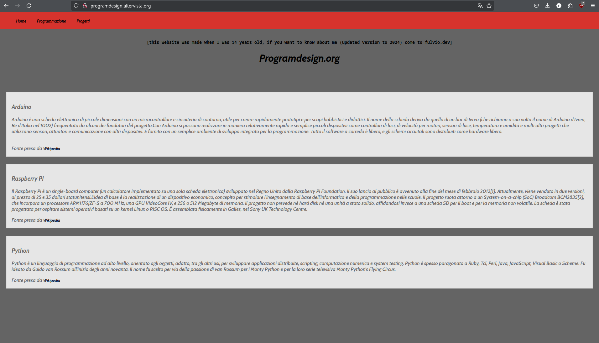
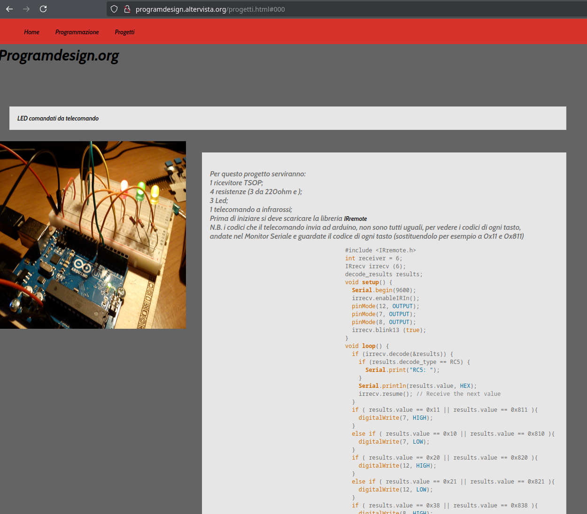

# Hello World! [A.A. 2025/2026]

Sono Fulvio Denza, 

ex rappresentante di dipartimento di informatica @ unipi

software engineer @<a href="civo.com">civo.com</a>

# Intro

Giusto per partire con la giusta dose di ansia, vi dico che oggi è una giornata chiave per voi, dovrete farvi l'idea del vostro percorso accademico, che vi porterà, successivamente, nel mondo della ricerca o del lavoro.

Mi hanno invitato qui oggi, in quanto, essendo stato ex rappresentante vi posso aiutare a farvi un'idea di cosa voglia dire frequentare la triennale di informatica a Pisa.

Inizio col dirvi che non è una facoltà facile e che non ci sono scorciatoie. È un indirizzo in cui dovrete abituarvi ad usare il vostro cervello per risolvere problemi. Non vi darà solo competenze base di matematica, programmazione, algoritmi etc, sarà anche riuscire a sviluppare un pensiero critico e capacità logico-deduttive per risolvere problemi che potrete traslare anche nella realtà fuori dal vostro PC.

# How it started

Vi faccio una breve introduzione a quello che è stato il mio percorso, nel caso ci sia qualcuno che si riconosca.

Ho iniziato abbastanza precocemente, avevo ancora cifra singola di anni quando ho mosso per la prima volta il cursore sul monitor e verso i 14 anni mi divertivo a fare cose del tipo:

Al tempo ne andavo fierissimo, oggi un po' meno, la grafica è quella che è, se qualcuno lo presentasse come sito a un colloquio non credo che avrebbe molte chances.

Quando arrivò per me, come per voi ora, il momento della scelta, non ebbi molte difficoltà, visto che sapevo esattamente che informatica sarebbe stata la mia scelta, mi trovavo a Perugia in quel periodo, e scelsi Pisa perchè al tempo lessi che Pisa è stata uno dei centri storici per l'informatica italiana e tuttora ha un altissimo livello di ricerca:
- Ha contribuito allo sviluppo della CEP, la calcolatrice elettronica pisana;
- È stato attivato il primo nodo della rete internet in Italia;

Ma non si vive solo del passato, e infatti ancora oggi ci sono professori incredibilmente bravi e livello di ricerca altissimo che vi potranno garantire un ambiente stimolante e un'insegnamento di alta qualità.

# Terrore per la matematica?

Ci sarà da studiare però non preoccupatevi, io venivo da un liceo classico, di matematica ne sapevo veramente poco e pensavo che fosse solo un noiosissimo esercizio di calcoli.

Ogni corso di matematica a informatica vi darà le giuste basi per mettere tutti sullo stesso livello. Dovrete solo dargli una possibilità e avere **costanza**.

Inoltre conoscere la matematica vi darà il superpotere di capire più a fondo il mondo attorno a voi usandola nella vostra vita quotidiana (che sia virtuale o fisica).

# Vivere l'università

Una pacchia.

> La mia triennale sono stati 5 anni bellissimi.

Sembra uno di quei film americani con i compagni di corso che girano per l'università con i libri in mano e ridendo a 32 denti:

Questa per intenderci.

Solo con meno sorrisi, perchè siete a informatica e la gente è più sudata.

Vivere l'università significa anche creare legami, condividere esperienze e crescere insieme:
- lunghe pause caffè alle macchinette
- piazza delle Vettovaglie (che forse già conoscerete)
- i migliori anni della vostra vita

Ma ci sono dei costi per questi anni così belli:
- studio intenso in periodo d'esame
- penserete che non sarà il percorso adatto a voi, perchè sarà difficile
- "perchè non ho fatto scienze politiche?"

Ci saranno corsi più ostici (magari anche solo da 6 CFU) e altri più facili (magari da 12 CFU). Molti esami hanno i cosidetti compitini (o parziali) che vi fanno evitare lo scritto del relativo esame e che, se studierete con costanza, non avrete problemi a passare.

Ricordate che l'università è l'ultimo momento in cui non sarete soli, ci saranno persone che vi guideranno e a cui potrete chiedere sempre aiuto perchè sono li per voi:
- rappresentanti, 
- professori,
- compagni di corso.

Inoltre gli studenti di informatica hanno più una conformazione da community online, non c'è concorrenza spietata tra studenti i quali si passano gratis persino i propri appunti in modo da aiutare gli altri.
Usano le loro competenze per condividere informazioni (magari è tempo di far conoscere alle persone <a href="https://informateci.it">informateci.it</a>?),
nonchè bot telegram per condividere il menù della mensa.

# Rappresentanza

Voglio anche fare un piccolo excursus sulla rappresentanza, credo ne valga la pena.
Farlo è un onore ed un onere, devi investire energie per farlo, parlare con gli studenti, capire i problemi e provare
a trovare una soluzione creando un punto di connessione tra gli studenti e i professori.

Farlo mi ha dato la possibilità di conoscere i professori anche sotto una luce differente da quella di professore.

Durante la mia esperienza abbiamo lavorato insieme per riformare il corso di laurea per rendere gli esami più gestibili dagli studenti
senza perdere la qualità di ciò che si insegnava, ognuno porta democraticamente le proprie esperienze, dai professori con più esperienza
fino ai rappresentanti degli studenti, che portano il loro punto di vista e per fare da guida ai professori su quali sono i sentimenti
generali degli studenti su una determinata proposta fatta in consiglio di dipartimento.

L'esperienza da rappresentante non è solo un modo per connettervi con praticamente la maggior parte degli studenti che un domani potrebbero essere vostri datori di lavoro, collaboratori o anche amici, ma anche
un'altra occasione per crescere e iniziare a modellare la vostra carriera e affinare le vostre abilità relazionali.

# Continuous Learning

l'informatica è innovazione, quindi
> ✨bisogna stare al passo con i tempi✨

Ma cosa significa questo?
Significa studiare, anche quando credete che avete finito.

Non studiate solo sui libri, ma anche sui fatti, anche da studenti, anche se penserete "ah no questa idea è troppo difficile da realizzare", provateci, alla peggio avrete fatto esperienza su uno studio di fattibilità.
Fate progetti con le tecnologie che imparate all'università o da soli.
Da lavoratori, still, progetti, non c'è via di scampo, per migliorare dovrete scrivere codice e lavorare su architetture, questo lo raggiungerete solo con l'esperienza, che otterrete con progetti, tenendo sempre un occhio di riguardo alla vostra salute mentale e, seppur con costanza, non facendolo ogni giorno, c'è il rischio di burnout. Vi assicuro che non è una bella esperienza.

# Sbocchi lavorativi

Il momento che più aspettavate:

È vero che con una laurea in informatica si trova uno sfracello di lavoro? 
TL;DR: Si, e se sei specializzato in qualcosa di richiesto dal mercato, verrai anche pagato uno sfracello.

Tutto sta nel trovare il proprio campo di interesse
Ci sono amici specializzati in blockchain, altri in AI, io per esempio mi sono specializzato in cloud e sistemi distribuiti.

Oggi mi capita di continuo su linkedin di vedere ex-colleghi dell'università di Pisa in tantissime aziende sparse in tutto il mondo: Google, Facebook, Texas Instruments e anche piccole startup di successo o grandi realtà nel settore (Hashicorp, Canonical, SUSE e altre).

Non vi capiterà solo di scrivere codice (cosa che ChatGPT fa, seppur mediocremente) ma anche lavorare su infrastrutture, su architetture software, sviluppo di progetti da 0 con tanto di business plan. Sarete capaci di portare a termine i vostri task con la conoscenza collettiva che saprete essere su internet, se saprete come cercare.

Con informatica (e, secondo la mia esperienza, in particolare informatica a Pisa) non sei solo programmatore sei una mente pensante che può svolgere ogni tipo di mansione nell'ambito dell'informatica (e qualche volta anche fuori dall'informatica).

## Conviene studiare informatica anche dopo l'avvento di ChatGPT?

Short Answer: Con cosa è fatto ChatGPT? `:)` 

# Communities!

Informatica a Pisa e ricca di communities in cui si può crescere professionalmente e umanamente

- pisa.dev: Fanno talks avanzati su argomenti interessantissimi.
- GDG (Google developer group) di Pisa: Un gruppo di sviluppatori interessati a tecnologie Google che fanno eventi e talks.
- Pointer Podcast: Un podcast creato da studenti di Pisa e che viene ascoltato da moltissime tech people in Italia.

# Conclusioni

Insomma, informatica è un percorso che vi garantirà una grande crescita personale e professionale.
Vi darà gli strumenti necessari per comprendere e modellare il mondo digitale che è sempre più in espansione.

Ricordate che ci saranno difficoltà che non andranno prese come fonte di scoraggiamento bensì come opportunità per migliorarvi. 
Se davvero vi piacerà quello che farete, con la giusta costanza raggiungerete ogni obiettivo.

Vi auguro di trovare la vostra strada, e di godervi ogni istante di questo viaggio, 

Benvenuti a Pisa e in bocca al lupo per il vostro futuro.
