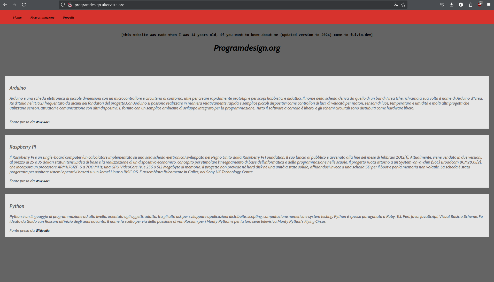
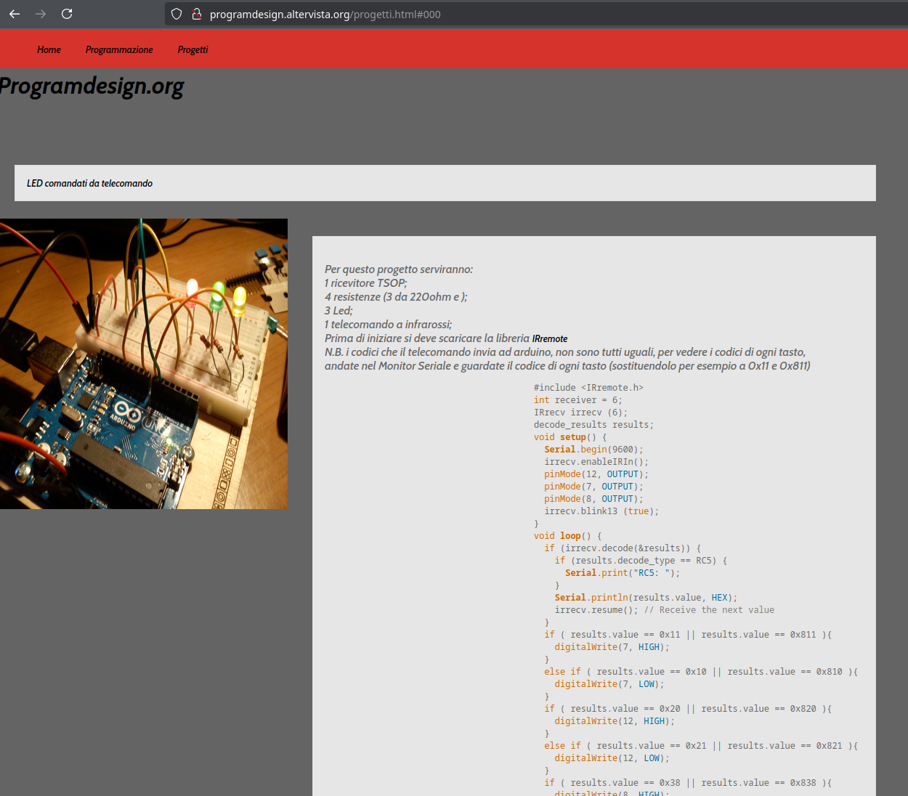

# 🗣️ 🗣️ 🗣️ Hello World!

```c
#include <stdio.h>

int main() {
    println("Hello World");
}
```
<!-- end_slide -->

# About me

<!-- end_slide -->

# About me

- Ex rappresentante di Dipartimento di Informatica @Unipi

<!-- end_slide -->

# About me

- Ex rappresentante di Dipartimento di Informatica @Unipi
- Software Engineer @civo

<!-- end_slide -->

# How it started

<!-- end_slide -->

# How it started

- Ho iniziato abbastanza presto:

<!-- end_slide -->

# How it started

- Ho iniziato abbastanza presto:
- A 14 anni mi divertivo a fare cose del tipo:

<!-- end_slide -->



<!-- end_slide -->



<!-- end_slide -->

# Intro

<!-- end_slide -->

# Intro

Oggi è una giornata chiave per voi.

<!-- end_slide -->

# Perché sono qui oggi?

<!-- end_slide -->

# Perché sono qui oggi?

Cosa significa frequentare Informatica a Pisa

<!-- end_slide -->

# Perché sono qui oggi?

Cosa significa frequentare Informatica a Pisa

- 🚫🏃‍♂️ Spoiler alert: non è una facoltà facile e non ci sono scorciatoie

<!-- end_slide -->

# Perché sono qui oggi?

Cosa significa frequentare Informatica a Pisa
x
- 🚫🏃‍♂️ Spoiler alert: non è una facoltà facile e non ci sono scorciatoie
- 🧠 Dovrete abituarvi a usare il vostro cervello per risolvere problemi

<!-- end_slide -->

# Ma...

<!-- end_slide -->

# Ma...

Ci sono dei pro!

<!-- end_slide -->

# Ma...

Ci sono dei pro!

- Basi di Programmazione, algoritmi, ma non solo!

<!-- end_slide -->

# Ma...

Ci sono dei pro!

- Basi di Programmazione, algoritmi, ma non solo!
- Pensiero critico

<!-- end_slide -->

# Ma...

Ci sono dei pro!

- Basi di Programmazione, algoritmi, ma non solo!
- Pensiero critico
- Capacita' logico-deduttive

<!-- end_slide -->

# La scelta di Pisa

<!-- end_slide -->

# La scelta di Pisa

- È stata uno dei centri storici per l'informatica italiana 🇮🇹💻

<!-- end_slide -->

# La scelta di Pisa

- È stata uno dei centri storici per l'informatica italiana 🇮🇹💻
    - Sviluppo della CEP (Calcolatrice Elettronica Pisana)

<!-- end_slide -->

# La scelta di Pisa

- È stata uno dei centri storici per l'informatica italiana 🇮🇹💻
    - Sviluppo della CEP (Calcolatrice Elettronica Pisana)
    - Primo nodo della rete Internet in Italia 🌐

<!-- end_slide -->

# Ma non si vive solo del passato!

<!-- end_slide -->

# Ma non si vive solo del passato!

- Professori incredibilmente bravi

<!-- end_slide -->

# Ma non si vive solo del passato!

- Professori incredibilmente bravi
- Ambiente stimolante e insegnamento di alta qualità

<!-- end_slide -->

# Ma non si vive solo del passato!

- Professori incredibilmente bravi
- Ambiente stimolante e insegnamento di alta qualità
- Alto livello di ricerca

<!-- end_slide -->

# Terrore per la matematica?

<!-- end_slide -->

# Terrore per la matematica?

- Io venivo da un liceo classico

<!-- end_slide -->

# Terrore per la matematica?

- Io venivo da un liceo classico
- Ogni corso di matematica vi darà le basi per mettere tutti sullo stesso livello

<!-- end_slide -->

# Terrore per la matematica?

- Io venivo da un liceo classico
- Ogni corso di matematica vi darà le basi per mettere tutti sullo stesso livello
- Inoltre, conoscere la matematica vi darà il superpotere di capire più a fondo il mondo attorno a voi 🌍✨


<!-- end_slide -->

# Vivere l'università

<!-- end_slide -->

# Vivere l'università

Una pacchia. 🎉

<!-- end_slide -->

# Vivere l'università

Una pacchia. 🎉

> "La mia triennale sono stati 5 anni bellissimi." 😅

<!-- end_slide -->

# Studenti felici

Questa per intenderci


<!-- end_slide -->

# Vivere l'università

<!-- end_slide -->

# Vivere l'università

- solo con meno sorrisi

<!-- end_slide -->

# Vivere l'università

- solo con meno sorrisi
- e la gente è più sudata 

<!-- end_slide -->

# Vivere l'università

- solo con meno sorrisi
- e la gente è più sudata, perchè siete a Informatica

<!-- end_slide -->

# Vivere l'università

<!-- end_slide -->

# Vivere l'università

- Lunghe pause caffè alle macchinette

<!-- end_slide -->

# Vivere l'università

- Lunghe pause caffè alle macchinette
- Professori che vi faranno crescere professionalmente e umanamente

<!-- end_slide -->

# Ma ci sono dei costi...

<!-- end_slide -->

# Ma ci sono dei costi...

- 📚 Studio intenso in periodo d'esame

<!-- end_slide -->

# Ma ci sono dei costi...

- 📚 Studio intenso in periodo d'esame
- 🤯 Penserete che non sarà il percorso adatto a voi, perché sarà difficile

<!-- end_slide -->

# Ma ci sono dei costi...

- 📚 Studio intenso in periodo d'esame
- 🤯 Penserete che non sarà il percorso adatto a voi, perché sarà difficile
- Ci saranno corsi più ostici

<!-- end_slide -->

# Ma ci sono dei costi...

- 📚 Studio intenso in periodo d'esame
- 🤯 Penserete che non sarà il percorso adatto a voi, perché sarà difficile
- Ci saranno corsi più ostici
- "Perché non ho fatto Scienze Politiche?"

<!-- end_slide -->

# Gli studenti di Informatica sembrano una community online

<!-- end_slide -->

# Gli studenti di Informatica sembrano una community online

- Non c'è concorrenza spietata

<!-- end_slide -->

# Gli studenti di Informatica sembrano una community online

- Non c'è concorrenza spietata
- 🤝 Si condividono appunti e risorse gratuitamente

<!-- end_slide -->

# Gli studenti di Informatica sembrano una community online

- Non c'è concorrenza spietata
- 🤝 Si condividono appunti e risorse gratuitamente
- Si utilizzano competenze per condividere informazioni

<!-- end_slide -->

# Gli studenti di Informatica sembrano una community online

- Non c'è concorrenza spietata
- 🤝 Si condividono appunti e risorse gratuitamente
- Si utilizzano competenze per condividere informazioni
    - informateci.it

<!-- end_slide -->

# Gli studenti di Informatica sembrano una community online

- Non c'è concorrenza spietata
- 🤝 Si condividono appunti e risorse gratuitamente
- Si utilizzano competenze per condividere informazioni
    - informateci.it
    - Bot Telegram per il menù della mensa 🍽️

<!-- end_slide -->

# Non sarete soli

<!-- end_slide -->

# Non sarete soli

- 🗣️ Rappresentanti e tutors

<!-- end_slide -->

# Non sarete soli

- 🗣️ Rappresentanti e tutors
- 👨‍🏫 Professori (non sempre sono vostri nemici)

<!-- end_slide -->

# Non sarete soli

- 🗣️ Rappresentanti e tutors
- 👨‍🏫 Professori (non sempre sono vostri nemici)
- 👩‍🎓👨‍🎓 Compagni di corso

<!-- end_slide -->

# Un piccolo excursus sulla rappresentanza

<!-- end_slide -->

# Un piccolo excursus sulla rappresentanza

- Farlo è un onore ed un onere ⚖️

<!-- end_slide -->

# Un piccolo excursus sulla rappresentanza

- Farlo è un onore ed un onere ⚖️
    - Investire energie, parlare con gli studenti, capire i problemi

<!-- end_slide -->

# Un piccolo excursus sulla rappresentanza

- Farlo è un onore ed un onere ⚖️
    - Investire energie, parlare con gli studenti, capire i problemi
    - Trovare soluzioni e creare connessione tra studenti e professori

<!-- end_slide -->

# Un piccolo excursus sulla rappresentanza

- Farlo è un onore ed un onere ⚖️
    - Investire energie, parlare con gli studenti, capire i problemi
    - Trovare soluzioni e creare connessione tra studenti e professori
- Mi ha permesso di conoscere i professori sotto una luce diversa

<!-- end_slide -->

# Un piccolo excursus sulla rappresentanza (cont'd)

<!-- end_slide -->

# Un piccolo excursus sulla rappresentanza (cont'd)

- Abbiamo lavorato insieme per riformare il corso di laurea e renderlo com'è ora

<!-- end_slide -->

# Un piccolo excursus sulla rappresentanza (cont'd)

- Abbiamo lavorato insieme per riformare il corso di laurea e renderlo com'è ora
    - Rendere gli esami più gestibili per gli studenti senza perdere qualità dei contenuti

<!-- end_slide -->

# Un piccolo excursus sulla rappresentanza (cont'd)

- Abbiamo lavorato insieme per riformare il corso di laurea e renderlo com'è ora
    - Rendere gli esami più gestibili per gli studenti senza perdere qualità dei contenuti
- Ognuno porta le proprie esperienze:

<!-- end_slide -->

# Un piccolo excursus sulla rappresentanza (cont'd)

- Abbiamo lavorato insieme per riformare il corso di laurea e renderlo com'è ora
    - Rendere gli esami più gestibili per gli studenti senza perdere qualità dei contenuti
- Ognuno porta le proprie esperienze:
    - Professori con più esperienza

<!-- end_slide -->

# Un piccolo excursus sulla rappresentanza (cont'd)

- Abbiamo lavorato insieme per riformare il corso di laurea e renderlo com'è ora
    - Rendere gli esami più gestibili per gli studenti senza perdere qualità dei contenuti
- Ognuno porta le proprie esperienze:
    - Professori con più esperienza
    - Rappresentanti che portano il punto di vista degli studenti

<!-- end_slide -->

# Continuous Learning

<!-- end_slide -->

# Continuous Learning

L'informatica è innovazione

<!-- end_slide -->

# Continuous Learning

L'informatica è innovazione

✨ Bisogna stare al passo con i tempi ✨

<!-- end_slide -->

# Continuous Learning

L'informatica è innovazione

✨ Bisogna stare al passo con i tempi ✨

- Non studiate solo sui libri, ma anche sui fatti, come? Facendo progetti con le tecnologie che imparate

<!-- end_slide -->

# Sbocchi lavorativi

Il momento che più aspettavate:

<!-- end_slide -->

# Sbocchi lavorativi

Il momento che più aspettavate:

> È vero che con una laurea in Informatica si trova uno sfracello di lavoro?

<!-- end_slide -->

# Sbocchi lavorativi

Il momento che più aspettavate:

> È vero che con una laurea in Informatica si trova uno sfracello di lavoro?

> TL;DR: Sì.

<!-- end_slide -->

# Sbocchi lavorativi (cont'd)

<!-- end_slide -->

# Sbocchi lavorativi (cont'd)

Trova il tuo campo di interesse

<!-- end_slide -->

# Sbocchi lavorativi (cont'd)

Trova il tuo campo di interesse
- blockchain

<!-- end_slide -->

# Sbocchi lavorativi (cont'd)

Trova il tuo campo di interesse
- blockchain
- AI

<!-- end_slide -->

# Sbocchi lavorativi (cont'd)

Trova il tuo campo di interesse
- blockchain
- AI
- cloud e sistemi distribuiti

<!-- end_slide -->

# Non solo programmazione

<!-- end_slide -->

# Non solo programmazione

- Non vi capiterà solo di scrivere codice (cosa che ChatGPT fa, seppur mediocremente)

<!-- end_slide -->

# Non solo programmazione

- Non vi capiterà solo di scrivere codice (cosa che ChatGPT fa, seppur mediocremente)
- Lavorerete su:

<!-- end_slide -->

# Non solo programmazione

- Non vi capiterà solo di scrivere codice (cosa che ChatGPT fa, seppur mediocremente)
- Lavorerete su:
    - Infrastrutture

<!-- end_slide -->

# Non solo programmazione

- Non vi capiterà solo di scrivere codice (cosa che ChatGPT fa, seppur mediocremente)
- Lavorerete su:
    - Infrastrutture
    - Architetture software

<!-- end_slide -->

# Non solo programmazione

- Non vi capiterà solo di scrivere codice (cosa che ChatGPT fa, seppur mediocremente)
- Lavorerete su:
    - Infrastrutture
    - Architetture software
    - Sviluppo di progetti da zero con business plan 📈

<!-- end_slide -->

# Non solo programmazione (cont'd)

<!-- end_slide -->

# Non solo programmazione (cont'd)

Con Informatica (soprattutto a Pisa) non sei solo programmatore:

<!-- end_slide -->

# Non solo programmazione (cont'd)

Con Informatica (soprattutto a Pisa) non sei solo programmatore:
- Sei una mente pensante 🧠

<!-- end_slide -->

# Non solo programmazione (cont'd)

Con Informatica (soprattutto a Pisa) non sei solo programmatore:
- Sei una mente pensante 🧠
- Puoi svolgere ogni tipo di mansione nell'ambito informatico

<!-- end_slide -->

# Non solo programmazione (cont'd)

Con Informatica (soprattutto a Pisa) non sei solo programmatore:
- Sei una mente pensante 🧠
- Puoi svolgere ogni tipo di mansione nell'ambito informatico
- A volte anche fuori dall'informatica!

<!-- end_slide -->

# Conviene studiare Informatica anche dopo l'avvento di ChatGPT?

<!-- end_slide -->

# Conviene studiare Informatica anche dopo l'avvento di ChatGPT?

Risposta breve: Con cosa è fatto ChatGPT? 😉

<!-- end_slide -->

# Conviene studiare Informatica anche dopo l'avvento di ChatGPT?

Risposta breve: Con cosa è fatto ChatGPT? 😉

L'informatica è alla base di queste tecnologie

<!-- end_slide -->

# Conviene studiare Informatica anche dopo l'avvento di ChatGPT?

Risposta breve: Con cosa è fatto ChatGPT? 😉

L'informatica è alla base di queste tecnologie

Studiare Informatica vi permetterà di creare e migliorare strumenti come ChatGPT

<!-- end_slide -->

# Communities!

Pisa è ricca di communities in cui crescere professionalmente e umanamente
    
<!-- end_slide -->

# Communities!

- pisa.dev 🌐 

<!-- end_slide -->

# Communities!

- pisa.dev 🌐 
    - Talks avanzati su argomenti interessantissimi

<!-- end_slide -->

# Communities!

- pisa.dev 🌐 
    - Talks avanzati su argomenti interessantissimi
- GDG Pisa (Google Developer Group) 🚀 

<!-- end_slide -->

# Communities!

- pisa.dev 🌐 
    - Talks avanzati su argomenti interessantissimi
- GDG Pisa (Google Developer Group) 🚀 
    - Gruppo di sviluppatori interessati a tecnologie Google

<!-- end_slide -->

# Communities!

- pisa.dev 🌐 
    - Talks avanzati su argomenti interessantissimi
- GDG Pisa (Google Developer Group) 🚀 
    - Gruppo di sviluppatori interessati a tecnologie Google
- Pointer Podcast 🎙️ 

<!-- end_slide -->

# Communities!

- pisa.dev 🌐 
    - Talks avanzati su argomenti interessantissimi
- GDG Pisa (Google Developer Group) 🚀 
    - Gruppo di sviluppatori interessati a tecnologie Google
- Pointer Podcast 🎙️ 
    - Podcast creato da studenti di Pisa
    
<!-- end_slide -->

# Communities!

- pisa.dev 🌐 
    - Talks avanzati su argomenti interessantissimi
- GDG Pisa (Google Developer Group) 🚀 
    - Gruppo di sviluppatori interessati a tecnologie Google
- Pointer Podcast 🎙️ 
    - Podcast creato da studenti di Pisa
- Superhero valley
    - Programma di mentoring per entrare nelle big tech
<!-- end_slide -->
# Partecipare vi aiuterà a:

<!-- end_slide -->

# Partecipare vi aiuterà a:

- Rimanere aggiornati sulle ultime tecnologie

<!-- end_slide -->

# Partecipare vi aiuterà a:

- Rimanere aggiornati sulle ultime tecnologie
- Conoscere persone con i vostri stessi interessi

<!-- end_slide -->

# Partecipare vi aiuterà a:

- Rimanere aggiornati sulle ultime tecnologie
- Conoscere persone con i vostri stessi interessi
- Crescere professionalmente e personalmente

<!-- end_slide -->

# Conclusioni

<!-- end_slide -->

# Conclusioni

- crescita personale e professionale

<!-- end_slide -->

# Conclusioni

- crescita personale e professionale
- modellare il mondo digitale

<!-- end_slide -->

# Conclusioni

- crescita personale e professionale
- modellare il mondo digitale
- difficoltà come opportunità per migliorarsi

<!-- end_slide -->

# Conclusioni

- crescita personale e professionale
- modellare il mondo digitale
- difficoltà come opportunità per migliorarsi
- costanza per raggiungere obiettivi

<!-- end_slide -->

# Un ultimo augurio

<!-- end_slide -->

# Un ultimo augurio

- Vi auguro di trovare la vostra strada e di godervi ogni istante di questo viaggio

<!-- end_slide -->

# Un ultimo augurio

- Vi auguro di trovare la vostra strada e di godervi ogni istante di questo viaggio
- Benvenuti al corso di studi di Informatica di Pisa e in bocca al lupo per il vostro futuro!

🚀
